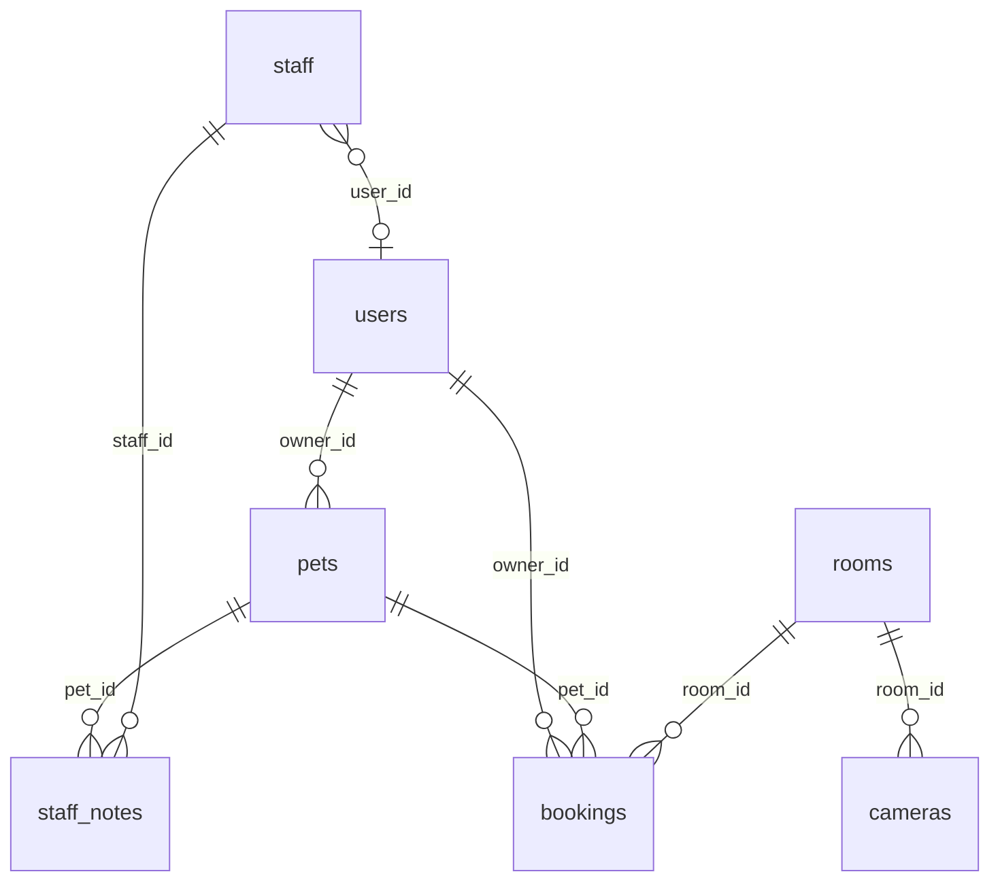

# PawHotel — «Уютные лапки»

Полноценный сайт отеля для домашних животных с лендингом, личным кабинетом, панелью администратора/персонала и CV-модулем определения состояния питомца.

---

## Стек технологий

### Backend
| Компонент         | Технология / версия                          |
|-------------------|----------------------------------------------|
| Веб-фреймворк     | FastAPI (Python 3.12)                        |
| ORM               | SQLAlchemy 2.0 (sync, `sessionmaker`)        |
| База данных       | PostgreSQL 16                                |
| Аутентификация    | JWT (PyJWT) — access + refresh tokens        |
| Хэширование паролей | bcrypt (напрямую, без passlib)             |
| CV-модуль         | YOLOv8-pose (ultralytics) + OpenCV           |
| Email             | Python stdlib `smtplib` + `email.mime`       |
| Настройки         | pydantic-settings + `.env`                   |
| Контейнеризация   | Docker (python:3.12-slim)                    |

### Frontend
| Компонент         | Технология / версия                          |
|-------------------|----------------------------------------------|
| UI-фреймворк      | React 18 + Vite 5                            |
| Роутинг           | React Router v6                              |
| HTTP-клиент       | Axios (с `api/client.js` обёрткой)           |
| HLS-видео         | hls.js + native Safari fallback              |
| Иконки            | react-icons (HeroIcons 2 + Material Design)  |
| CSS               | Vanilla CSS + CSS-переменные                 |
| Шрифт             | Jost (Google Fonts)                          |
| Контейнеризация   | Docker (node:20-alpine → nginx:alpine)       |

### Инфраструктура
| Компонент         | Технология                                   |
|-------------------|----------------------------------------------|
| Оркестрация       | Docker Compose                               |
| Reverse proxy     | nginx (фронтенд + проксирование на бэкенд)   |
| WebSocket         | FastAPI native WebSocket                     |

---

## Переменные окружения (`backend/.env`)

```env
# База данных
DATABASE_URL=postgresql://pawhotel:pawhotel@db:5432/pawhotel

# JWT
SECRET_KEY=your-very-secret-key-change-me
ACCESS_TOKEN_EXPIRE_MINUTES=60
REFRESH_TOKEN_EXPIRE_DAYS=30

# Первый администратор (создаётся при первом запуске)
FIRST_ADMIN_EMAIL=admin@pawhotel.ru
FIRST_ADMIN_PASSWORD=admin123

# SMTP (опционально — без этих значений письма выводятся в консоль)
SMTP_HOST=smtp.yandex.ru
SMTP_PORT=587
SMTP_USER=your@yandex.ru
SMTP_PASSWORD=your-app-password
SMTP_FROM=your@yandex.ru
```

---

## База данных: таблицы и колонки

### `users`
| Колонка        | Тип              | Ограничения            | Описание                      |
|----------------|------------------|------------------------|-------------------------------|
| `id`           | INTEGER          | PK, autoincrement      |                               |
| `email`        | VARCHAR(255)     | UNIQUE, NOT NULL       |                               |
| `password_hash`| VARCHAR(255)     | NOT NULL               | bcrypt-хэш                    |
| `first_name`   | VARCHAR(100)     |                        |                               |
| `last_name`    | VARCHAR(100)     |                        |                               |
| `middle_name`  | VARCHAR(100)     |                        |                               |
| `phone`        | VARCHAR(20)      |                        |                               |
| `date_of_birth`| DATE             |                        |                               |
| `role`         | VARCHAR(20)      | default `'client'`     | `client` / `admin` / `staff`  |
| `is_active`    | BOOLEAN          | default `true`         |                               |
| `avatar_url`   | VARCHAR(500)     |                        |                               |
| `created_at`   | TIMESTAMP        | server_default now()   |                               |

### `staff`
Публичный профиль сотрудника (лендинг, секция «Наша команда»). Не связан с `users` на уровне FK в схеме, но концептуально соответствует сотруднику с ролью `staff`.

| Колонка       | Тип              | Ограничения       | Описание              |
|---------------|------------------|-------------------|-----------------------|
| `id`          | INTEGER          | PK                |                       |
| `user_id`     | INTEGER          | FK → users.id     | Связанный аккаунт     |
| `first_name`  | VARCHAR(100)     |                   |                       |
| `last_name`   | VARCHAR(100)     |                   |                       |
| `position`    | VARCHAR(200)     |                   | Должность             |
| `photo_url`   | VARCHAR(500)     |                   |                       |
| `description` | TEXT             |                   |                       |
| `is_active`   | BOOLEAN          | default `true`    |                       |

### `rooms`
| Колонка        | Тип              | Ограничения       | Описание                              |
|----------------|------------------|-------------------|---------------------------------------|
| `id`           | INTEGER          | PK                |                                       |
| `number`       | VARCHAR(20)      | UNIQUE, NOT NULL  | Номер комнаты (напр. `101`)           |
| `type`         | VARCHAR(20)      |                   | `standard` / `comfort` / `vip`        |
| `capacity`     | INTEGER          |                   | Макс. кол-во питомцев                 |
| `price_per_day`| NUMERIC(10,2)    |                   |                                       |
| `description`  | TEXT             |                   |                                       |
| `is_available` | BOOLEAN          | default `true`    |                                       |
| `features`     | JSON             |                   | Список удобств (`["wifi", "tv", ...]`)|

### `cameras`
| Колонка     | Тип           | Ограничения    | Описание                        |
|-------------|---------------|----------------|---------------------------------|
| `id`        | INTEGER       | PK             |                                 |
| `name`      | VARCHAR(200)  |                | Название камеры                 |
| `stream_url`| VARCHAR(500)  |                | HLS URL или RTSP                |
| `room_id`   | INTEGER       | FK → rooms.id  | `NULL` для общественных зон     |
| `zone_type` | VARCHAR(20)   |                | `room` / `public`               |
| `is_active` | BOOLEAN       | default `true` |                                 |

### `pets`
| Колонка      | Тип           | Ограничения       | Описание                                  |
|--------------|---------------|-------------------|-------------------------------------------|
| `id`         | INTEGER       | PK                |                                           |
| `owner_id`   | INTEGER       | FK → users.id     | Владелец                                  |
| `name`       | VARCHAR(100)  | NOT NULL          |                                           |
| `species`    | VARCHAR(50)   |                   | `dog` / `cat` / `rabbit` / `bird` / `other`|
| `breed`      | VARCHAR(100)  |                   |                                           |
| `age`        | INTEGER       |                   | Возраст в годах                           |
| `gender`     | VARCHAR(10)   |                   | `male` / `female`                         |
| `photo_url`  | VARCHAR(500)  |                   |                                           |
| `extra_notes`| TEXT          |                   | Особые пометки от владельца               |
| `created_at` | TIMESTAMP     | server_default    |                                           |

### `bookings`
| Колонка         | Тип           | Ограничения       | Описание                                          |
|-----------------|---------------|-------------------|---------------------------------------------------|
| `id`            | INTEGER       | PK                |                                                   |
| `pet_id`        | INTEGER       | FK → pets.id      |                                                   |
| `room_id`       | INTEGER       | FK → rooms.id     |                                                   |
| `owner_id`      | INTEGER       | FK → users.id     |                                                   |
| `check_in_date` | DATE          | NOT NULL          |                                                   |
| `check_out_date`| DATE          | NOT NULL          |                                                   |
| `status`        | VARCHAR(20)   | default `pending` | `pending`/`confirmed`/`active`/`completed`/`cancelled`|
| `total_price`   | NUMERIC(10,2) |                   |                                                   |
| `notes`         | TEXT          |                   | Особые пожелания при заселении                    |
| `created_at`    | TIMESTAMP     | server_default    |                                                   |

### `staff_notes`
| Колонка      | Тип           | Ограничения       | Описание                                   |
|--------------|---------------|-------------------|--------------------------------------------|
| `id`         | INTEGER       | PK                |                                            |
| `pet_id`     | INTEGER       | FK → pets.id      |                                            |
| `staff_id`   | INTEGER       | FK → staff.id     | Автор заметки (NULL если системная)        |
| `content`    | TEXT          | NOT NULL          |                                            |
| `is_public`  | BOOLEAN       | default `true`    | Если `true` — видна владельцу питомца      |
| `created_at` | TIMESTAMP     | server_default    |                                            |

Дополнительный join: `StaffNote` → `Staff` → `User` для отображения имени автора (`staff_member.first_name`, `staff_member.last_name`).

### `gallery`
| Колонка      | Тип           | Ограничения    | Описание            |
|--------------|---------------|----------------|---------------------|
| `id`         | INTEGER       | PK             |                     |
| `photo_url`  | VARCHAR(500)  |                |                     |
| `caption`    | VARCHAR(300)  |                |                     |
| `sort_order` | INTEGER       | default `0`    |                     |
| `is_active`  | BOOLEAN       | default `true` |                     |
| `created_at` | TIMESTAMP     | server_default |                     |

### `tariffs`
| Колонка       | Тип           | Ограничения    | Описание                            |
|---------------|---------------|----------------|-------------------------------------|
| `id`          | INTEGER       | PK             |                                     |
| `name`        | VARCHAR(200)  |                |                                     |
| `description` | TEXT          |                |                                     |
| `price_per_day`| NUMERIC(10,2)|                |                                     |
| `features`    | JSON          |                | Список включённых услуг             |
| `is_active`   | BOOLEAN       | default `true` |                                     |
| `sort_order`  | INTEGER       | default `0`    |                                     |
| `color`       | VARCHAR(20)   |                | CSS-цвет карточки тарифа            |
| `is_featured` | BOOLEAN       | default `false`| Выделенный тариф («Рекомендуем»)    |

### `verification_codes`
| Колонка      | Тип           | Ограничения    | Описание                                 |
|--------------|---------------|----------------|------------------------------------------|
| `id`         | INTEGER       | PK             |                                          |
| `email`      | VARCHAR(255)  | NOT NULL       | Indexed                                  |
| `code`       | VARCHAR(6)    | NOT NULL       | 6-значный цифровой код                   |
| `type`       | VARCHAR(20)   | NOT NULL       | `register` / `reset`                     |
| `expires_at` | DATETIME      | NOT NULL       | now() + 10 минут                         |
| `used`       | BOOLEAN       | default `false`| Помечается `true` при использовании      |
| `created_at` | TIMESTAMP     | server_default |                                          |

---

## ER-диаграмма

```
users ──< pets ──< bookings >── rooms ──< cameras
  │         │
  │         └──< staff_notes >── staff
  │
  └──< bookings

users ──< verification_codes (email, не FK)
gallery, tariffs — независимые таблицы
```



---

## REST API — полная таблица эндпоинтов

### Авторизация `/api/auth`
| Метод | Путь                  | Доступ   | Описание                                         |
|-------|-----------------------|----------|--------------------------------------------------|
| POST  | `/register`           | Public   | Прямая регистрация (без email-подтверждения)     |
| POST  | `/login`              | Public   | Вход; возвращает `access_token`, `refresh_token` |
| POST  | `/refresh`            | Public   | Обновление access-токена по refresh-токену        |
| POST  | `/send-code`          | Public   | Отправить 6-значный код на email (`type`: register/reset) |
| POST  | `/verify-register`    | Public   | Подтвердить email + создать аккаунт              |
| POST  | `/verify-reset`       | Public   | Подтвердить код + сменить пароль                 |

**Форматы запросов:**
```json
// POST /send-code
{ "email": "user@example.com", "type": "register" }

// POST /verify-register
{ "email": "...", "code": "123456", "first_name": "...", "last_name": "...", "phone": "...", "password": "..." }

// POST /verify-reset
{ "email": "...", "code": "123456", "new_password": "..." }

// POST /login → ответ
{ "access_token": "...", "refresh_token": "...", "token_type": "bearer" }
```

### Пользователи `/api/users`
| Метод | Путь        | Доступ        | Описание                              |
|-------|-------------|---------------|---------------------------------------|
| GET   | `/me`       | Авторизован   | Данные текущего пользователя          |
| PUT   | `/me`       | Авторизован   | Обновить профиль                      |

### Питомцы `/api/pets`
| Метод | Путь        | Доступ        | Описание                              |
|-------|-------------|---------------|---------------------------------------|
| GET   | `/`         | Авторизован   | Питомцы текущего пользователя         |
| POST  | `/`         | Авторизован   | Создать питомца                       |
| PUT   | `/{id}`     | Авторизован   | Обновить питомца                      |
| DELETE| `/{id}`     | Авторизован   | Удалить питомца                       |

### Комнаты `/api/rooms`
| Метод | Путь        | Доступ        | Описание                              |
|-------|-------------|---------------|---------------------------------------|
| GET   | `/`         | Public        | Список комнат (можно: `?available=true`)|
| GET   | `/{id}`     | Public        | Детали комнаты                        |
| POST  | `/`         | Admin strict  | Создать комнату                       |
| PUT   | `/{id}`     | Admin strict  | Обновить комнату                      |
| DELETE| `/{id}`     | Admin strict  | Удалить комнату                       |

### Бронирования `/api/bookings`
| Метод | Путь        | Доступ        | Описание                              |
|-------|-------------|---------------|---------------------------------------|
| GET   | `/`         | Авторизован   | Бронирования текущего пользователя    |
| POST  | `/`         | Авторизован   | Создать бронирование                  |
| DELETE| `/{id}`     | Авторизован   | Отменить бронирование                 |

### Персонал (публичный) `/api/staff`
| Метод | Путь        | Доступ        | Описание                              |
|-------|-------------|---------------|---------------------------------------|
| GET   | `/`         | Public        | Список активного персонала            |
| POST  | `/`         | Admin strict  | Добавить сотрудника                   |
| PUT   | `/{id}`     | Admin strict  | Обновить сотрудника                   |
| DELETE| `/{id}`     | Admin strict  | Удалить сотрудника                    |

### Камеры `/api/cameras`
| Метод | Путь           | Доступ        | Описание                              |
|-------|----------------|---------------|---------------------------------------|
| GET   | `/public`      | Public        | Публичные камеры (zone_type=public)   |
| GET   | `/pet/{pet_id}`| Авторизован   | Камера в комнате питомца (активное бронирование) |
| GET   | `/`            | Admin+Staff   | Все камеры                            |
| POST  | `/`            | Admin strict  | Добавить камеру                       |
| PUT   | `/{id}`        | Admin strict  | Обновить камеру                       |
| DELETE| `/{id}`        | Admin strict  | Удалить камеру                        |

### Галерея `/api/gallery`
| Метод | Путь        | Доступ        | Описание                              |
|-------|-------------|---------------|---------------------------------------|
| GET   | `/`         | Public        | Активные фото галереи                 |
| POST  | `/`         | Admin strict  | Добавить фото                         |
| PUT   | `/{id}`     | Admin strict  | Обновить                              |
| DELETE| `/{id}`     | Admin strict  | Удалить                               |

### Тарифы `/api/tariffs`
| Метод | Путь        | Доступ        | Описание                              |
|-------|-------------|---------------|---------------------------------------|
| GET   | `/`         | Public        | Активные тарифы, отсортированные      |
| POST  | `/`         | Admin strict  | Создать тариф                         |
| PUT   | `/{id}`     | Admin strict  | Обновить тариф                        |
| DELETE| `/{id}`     | Admin strict  | Удалить тариф                         |

### Заметки персонала `/api/notes`
| Метод | Путь              | Доступ        | Описание                              |
|-------|-------------------|---------------|---------------------------------------|
| GET   | `/pet/{pet_id}`   | Авторизован   | Публичные заметки по питомцу (владелец видит только свои) |
| POST  | `/`               | Admin+Staff   | Создать заметку                       |
| DELETE| `/{id}`           | Admin+Staff   | Удалить заметку                       |

### Административные эндпоинты `/api/admin`
| Метод | Путь              | Доступ        | Описание                                    |
|-------|-------------------|---------------|---------------------------------------------|
| GET   | `/dashboard`      | Admin strict  | Статистика: users, pets, bookings, rooms    |
| GET   | `/users`          | Admin strict  | Все пользователи                            |
| PUT   | `/users/{id}`     | Admin strict  | Изменить роль/статус пользователя           |
| GET   | `/pets`           | Admin+Staff   | Все питомцы (с owner)                       |
| GET   | `/bookings`       | Admin+Staff   | Все бронирования (`?status=active` и т.д.)  |
| PATCH | `/bookings/{id}`  | Admin strict  | Изменить статус бронирования                |
| GET   | `/notes`          | Admin+Staff   | Все заметки персонала                       |

---

## WebSocket — CV-детектор

**URL:** `ws://<host>/ws/detect`

**Протокол:**
```json
// Клиент → сервер (каждые ~1.5 сек)
{
  "frame": "<base64-encoded JPEG>",
  "pet_id": 42
}

// Сервер → клиент
{
  "pet_id": 42,
  "state": "lying",
  "confidence": 0.91,
  "label": "Лежит"
}
```

**Состояния:**
| state      | label    | Описание                           |
|------------|----------|------------------------------------|
| `lying`    | Лежит    | Собака лежит                       |
| `sitting`  | Сидит    | Собака сидит                       |
| `standing` | Стоит    | Собака стоит                       |
| `moving`   | Активен  | Собака движется                    |
| `unknown`  | Неизвестно| Объект не обнаружен / нет уверенности |

---

## Система аутентификации

### Токены
- **Access token** — JWT, TTL: 60 минут, payload: `sub` (user_id), `exp`
- **Refresh token** — JWT, TTL: 30 дней, payload: `sub`, `exp`, `type: "refresh"`
- **Reset token** — JWT, TTL: 15 минут, payload: `sub`, `exp`, `ph` (fingerprint хэша пароля, аннулирует токен после смены пароля)

Хранение: `Authorization: Bearer <access_token>` в заголовке каждого запроса. Refresh-токен хранится в `localStorage` на фронтенде.

### Роли
| Роль     | Описание                                                              |
|----------|-----------------------------------------------------------------------|
| `client` | Обычный пользователь: питомцы, бронирования, заметки (только чтение) |
| `staff`  | Персонал: питомцы, заметки, бронирования (только просмотр/заметки)   |
| `admin`  | Полный доступ ко всем эндпоинтам и панели управления                  |

### Зависимости FastAPI (deps.py)
- `get_current_user` — любой авторизованный пользователь
- `get_current_admin` — `admin` или `staff`
- `get_strict_admin` — только `admin`

### Email-верификация
1. Клиент вызывает `POST /api/auth/send-code` с `{ email, type }`
2. Бэкенд генерирует 6-значный цифровой код, сохраняет в `verification_codes` (TTL 10 мин), отправляет email
3. Клиент вводит код и вызывает `POST /api/auth/verify-register` или `POST /api/auth/verify-reset`
4. Бэкенд проверяет код (не истёк, не использован), помечает `used=true`, создаёт аккаунт / меняет пароль

---

## CV-система (YOLOv8-pose)

### Архитектура
```
browser (canvas API)
    │ base64 JPEG frame (WebSocket)
    ▼
/ws/detect  (FastAPI WebSocket)
    │
    ├─ _load_model()          — ленивая загрузка YOLOv8
    ├─ _run_yolo(frame)       — инференс + выбор лучшего bbox
    └─ _classify_by_keypoints(kps) — геометрическая доработка
         → state, confidence
```

### Весовые файлы
Модель ожидается по пути `backend/app/cv/dog_pose.pt`.

При отсутствии файла автоматически включается `_fallback_heuristic()` — детектор на основе OpenCV-контуров (соотношение сторон bounding box).

### Ключевые точки (24 точки)
Модель обучена на YOLOv8-pose, 3 класса:
- `0` — Lie-Down (лежит)
- `1` — SIT (сидит)
- `2` — Stand-UP (стоит)

Функция `_classify_by_keypoints(kps)` уточняет результат по геометрии: углы суставов, относительные позиции точек скелета.

### Авто-заметки (фоновая задача)
Каждые 30 минут (`cv_auto_notes_loop`):
1. Получить все активные бронирования из БД
2. Для каждого: найти камеру в комнате питомца
3. Захватить кадр через `cv2.VideoCapture(stream_url)`
4. Прогнать через YOLO / fallback-эвристику
5. Создать `StaffNote` с `is_public=False`, содержимое: `[CV] Состояние питомца: <label> (уверенность: X%)`

Задача запускается через `asyncio.create_task()` в FastAPI lifespan, блокирующие операции выполняются через `loop.run_in_executor(None, func)`.

---

## Email-система

### Отправитель (`backend/app/core/email.py`)

Функция `_smtp_send()` отправляет HTML-письмо через `smtplib.SMTP` с STARTTLS.

**Dev-режим:** если `SMTP_USER` пустой — письмо не отправляется, содержимое печатается в stdout.

### Типы писем

#### Код подтверждения (`send_code_email`)
Отправляется при регистрации и сбросе пароля. Содержит 6-значный код в крупном стиле, срок действия 10 минут.

#### Ежедневный отчёт (`send_daily_report_email`)
Отправляется в 20:00 каждый день всем владельцам питомцев, у которых есть хотя бы одна публичная заметка за текущий день.

Содержание: список питомцев → для каждого таблица заметок (время + текст).

**Фоновая задача** (`daily_report_loop` в `backend/app/cv/daily_report.py`):
1. При старте вычисляет время до следующего 20:00
2. `asyncio.sleep(seconds)`
3. Вызывает `_send_reports_sync()` через `run_in_executor`
4. Планирует следующий запуск (+24 часа)

---

## Структура проекта

```
pet-hotel/
├── docker-compose.yml
├── README.md
│
├── backend/
│   ├── Dockerfile
│   ├── requirements.txt
│   ├── .env.example
│   └── app/
│       ├── main.py                  # FastAPI app, lifespan, маршруты
│       ├── config.py                # Settings (pydantic-settings)
│       ├── database.py              # SQLAlchemy engine + SessionLocal
│       ├── models/
│       │   └── models.py            # Все ORM-модели (Base + все таблицы)
│       ├── schemas/
│       │   └── schemas.py           # Pydantic In/Out схемы
│       ├── core/
│       │   ├── security.py          # create_token, decode_token, hash_password
│       │   ├── email.py             # _smtp_send, send_code_email, send_daily_report_email
│       │   └── deps.py              # get_current_user, get_current_admin, get_strict_admin
│       ├── cv/
│       │   ├── detector.py          # WebSocket /ws/detect, YOLOv8, fallback
│       │   ├── auto_notes.py        # Фоновый loop: CV → StaffNote каждые 30 мин
│       │   └── daily_report.py      # Фоновый loop: ежедневный email в 20:00
│       └── api/
│           ├── deps.py              # (дублирован для удобства импорта)
│           └── routes/
│               ├── auth.py          # /api/auth/*
│               ├── users.py         # /api/users/*
│               ├── pets.py          # /api/pets/*
│               ├── rooms.py         # /api/rooms/*
│               ├── bookings.py      # /api/bookings/*
│               ├── staff.py         # /api/staff/*
│               ├── cameras.py       # /api/cameras/*
│               ├── gallery.py       # /api/gallery/*
│               ├── tariffs.py       # /api/tariffs/*
│               ├── notes.py         # /api/notes/*
│               └── admin.py         # /api/admin/*
│
└── frontend/
    ├── Dockerfile                   # prod: node build → nginx
    ├── nginx.conf                   # SPA routing + /api proxy
    ├── package.json
    ├── vite.config.js               # dev proxy → backend:8000
    └── src/
        ├── App.jsx                  # React Router, ProtectedRoute
        ├── index.css                # CSS-переменные, глобальные стили
        ├── main.jsx
        ├── api/
        │   └── client.js            # Axios instance + authApi, petsApi, bookingsApi,
        │                            #   camerasApi, notesApi, adminApi, staffApi, ...
        ├── context/
        │   └── AuthContext.jsx      # useAuth(), user, login, logout, loading
        ├── pages/
        │   ├── LandingPage.jsx      # Публичный лендинг
        │   ├── CabinetPage.jsx      # Личный кабинет (авторизован)
        │   ├── AdminPage.jsx        # /admin/* (admin + staff)
        │   └── DocsPage.jsx         # Документация
        └── components/
            ├── Header.jsx
            ├── Footer.jsx
            ├── AuthModal.jsx        # Вход / регистрация / верификация / сброс пароля
            ├── landing/
            │   ├── HeroSection.jsx
            │   ├── AdvantagesSection.jsx
            │   ├── CamerasSection.jsx   # HLS-потоки с публичных камер
            │   ├── GallerySection.jsx
            │   ├── StaffSection.jsx
            │   ├── TariffsSection.jsx
            │   ├── HowToCheckIn.jsx
            │   └── ContactsSection.jsx
            ├── cabinet/
            │   ├── PetCard.jsx          # Карточка питомца, редактирование, заметки
            │   ├── PetCard.css
            │   ├── BookingModal.jsx      # Форма бронирования
            │   ├── BookingModal.css
            │   ├── PetStream.jsx         # HLS-плеер камеры + CV overlay
            │   ├── PetStream.css
            │   ├── CvTestPanel.jsx       # Загрузка видео + тест CV модели
            │   └── CvTestPanel.css
            └── admin/
                ├── AdminLayout.jsx       # Сайдбар (разный для admin / staff)
                ├── Dashboard.jsx         # Статистика для admin
                ├── StaffDashboard.jsx    # Главная для staff: питомцы + пожелания
                ├── StaffDashboard.css
                ├── BookingsManager.jsx   # CRUD бронирований
                ├── ClientsManager.jsx    # Управление пользователями
                ├── PetsManager.jsx       # Просмотр питомцев
                ├── RoomsManager.jsx      # CRUD комнат
                ├── CamerasManager.jsx    # CRUD камер
                ├── StaffManager.jsx      # CRUD профилей персонала
                ├── GalleryManager.jsx    # CRUD галереи
                ├── TariffsManager.jsx    # CRUD тарифов
                └── NotesManager.jsx      # Просмотр + создание заметок
```

---

## Фронтенд: роль-ориентированный интерфейс

Маршрут `/admin/*` рендерит разный контент в зависимости от `user.role`:

| Раздел              | admin | staff |
|---------------------|-------|-------|
| Dashboard           | ✓     | StaffDashboard (упрощённый) |
| Бронирования        | ✓     | — (редирект)               |
| Клиенты             | ✓     | —                          |
| Питомцы             | ✓     | ✓                          |
| Комнаты             | ✓     | —                          |
| Камеры              | ✓     | —                          |
| Персонал            | ✓     | —                          |
| Галерея             | ✓     | —                          |
| Тарифы              | ✓     | —                          |
| Заметки             | ✓     | ✓                          |

Реализовано в `AdminPage.jsx` через условные `<Route>` + `<Navigate replace />`.

---

## HLS-видеопотоки

Используется **hls.js** для MSE-совместимых браузеров, native HLS для Safari.

```jsx
function HlsPlayer({ src }) {
  const videoRef = useRef()
  useEffect(() => {
    if (Hls.isSupported()) {
      const hls = new Hls()
      hls.loadSource(src)
      hls.attachMedia(videoRef.current)
      return () => hls.destroy()
    } else if (videoRef.current.canPlayType('application/vnd.apple.mpegurl')) {
      videoRef.current.src = src
    }
  }, [src])
  return <video ref={videoRef} controls autoPlay muted />
}
```

CSS-контейнер использует трюк с `padding-bottom: 56.25%` (16:9) и `position: absolute` для дочерних `iframe` и `video`.

---

## Быстрый запуск (Docker Compose)

```bash
git clone <repo> pet-hotel && cd pet-hotel
cp backend/.env.example backend/.env
# Отредактируйте backend/.env — смените SECRET_KEY и FIRST_ADMIN_PASSWORD
docker compose up --build
```

| URL                            | Описание              |
|--------------------------------|-----------------------|
| http://localhost               | Сайт (nginx)          |
| http://localhost:8000          | Backend API           |
| http://localhost:8000/docs     | Swagger UI            |
| http://localhost:8000/redoc    | ReDoc                 |

Первый запуск автоматически создаёт все таблицы и аккаунт администратора.

> **Важно:** смените `SECRET_KEY` и `FIRST_ADMIN_PASSWORD` в `.env` перед деплоем!

---

## Запуск без Docker (разработка)

### Backend
```bash
cd backend
python -m venv venv && source venv/bin/activate
pip install -r requirements.txt
cp .env.example .env          # настройте DATABASE_URL
uvicorn app.main:app --reload --port 8000
```

### Frontend
```bash
cd frontend
npm install
npm run dev                    # http://localhost:5173
```

При локальном запуске proxy в `vite.config.js` уже настроен на `http://backend:8000` для Docker и должен быть изменён на `http://localhost:8000` для локальной разработки.

---

## Деплой на VPS

```bash
# Установить Docker
curl -fsSL https://get.docker.com | sh

git clone <repo> pet-hotel && cd pet-hotel
cp backend/.env.example backend/.env
nano backend/.env

docker compose up -d --build
```

Для домена и HTTPS: добавить Nginx + Certbot перед контейнерами или использовать Traefik.

---

## Цветовая палитра

| CSS-переменная        | HEX       | Назначение                  |
|-----------------------|-----------|-----------------------------|
| `--primary`           | `#E8956D` | Основной бренд-цвет (коралл)|
| `--primary-dark`      | `#D4754A` | Hover / акцент              |
| `--primary-light`     | `#F5C4A7` | Мягкий акцент               |
| `--primary-ultra`     | `#FFF0E8` | Фон акцентных блоков        |
| `--secondary`         | `#5BA4A4` | Бирюзовый — второстепенный  |
| `--secondary-dark`    | `#3D8080` | Hover бирюзового            |
| `--accent`            | `#FFE8DB` | Фоновые выделения           |
| `--bg`                | `#FFF8F3` | Основной фон страницы       |
| `--bg-card`           | `#FFFFFF` | Фон карточек                |
| `--bg-dark`           | `#2C3E50` | Тёмные секции / сайдбар     |
| `--text`              | `#2C3E50` | Основной текст              |
| `--text-secondary`    | `#6B7B8D` | Вторичный текст             |
| `--border`            | `#F0DDD0` | Рамки и разделители         |
| `--success`           | `#6BCB77` | Успех / активно             |
| `--warning`           | `#FFD166` | Предупреждение              |
| `--error`             | `#EF6351` | Ошибка                      |
